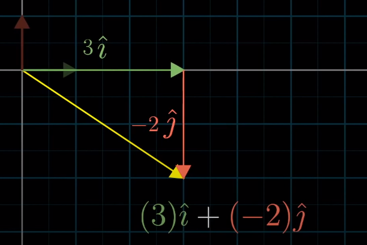
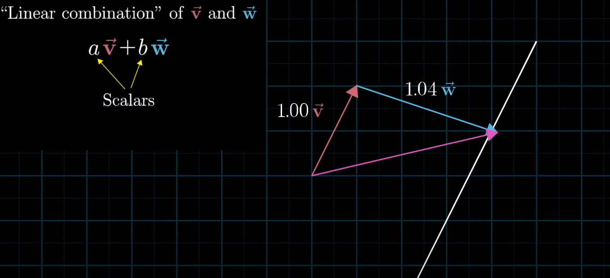
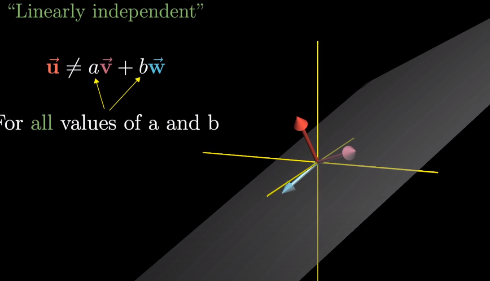

# Last Time
- Vector Coordinates

# Vector Coordinates
- Pair of numbers to describe a vector
    - Think of each coordinate as a scalar that scales the x, y coordiantes
# [3, -2]
- 3 = x = ihat
    - ihat gets scaled by 3 in the positive x direciton
- -2 = y = yhat
    - yhat gets scaled by -2 in the negative y direction
- Resulting Vector described by [3, -2] 
    - (3)ihat + (-2)jhat
    
# Basis of a coordinate system
- ihat and jhat 
- What if we had chosen different basis vectors?
- With normal ihat, jhat vectors, we can reach all possible vectors on the standard coordinate system
- Always wonder why we are using the linear combination of basis vectors
- ## What is the Lienar Combination of basis vectors?
    - If you fix one of the basis vectors and scale the other, you produce a straight line
    
# Vector Span
- The span of most vectors is the set of all their linear combinations
    - In most cases this means we can reach all vectors

# How to think about vectors
- ### Individual Vectors
    - Best to imagine these as arrows pointing in space
- ### Collections of Vectors
    - Best to imagine these as points in space

# Span of 3d Vectors
- Linear combination of all 3 basis vectors within the 3d vectors coordinates

# Linearly Dependent Vectors
- Vectors stacked on top of each other such that removing one will not decrease the "Span" of the vectors

# Linearly Independent Vectors
- A set of vectors where adding a vector increases the span of the linear combination of the vectors
