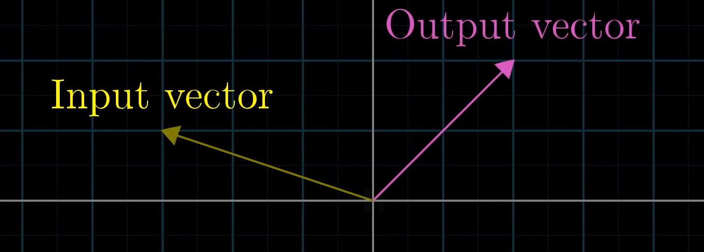
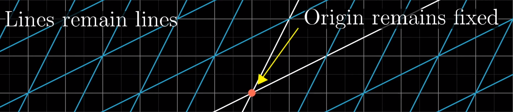
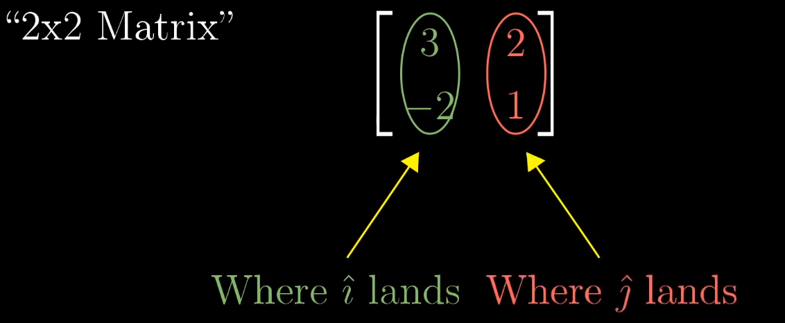
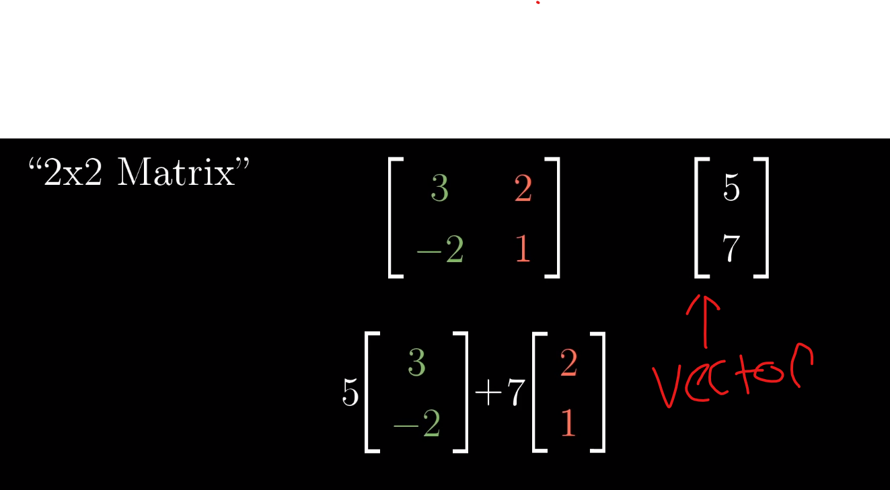
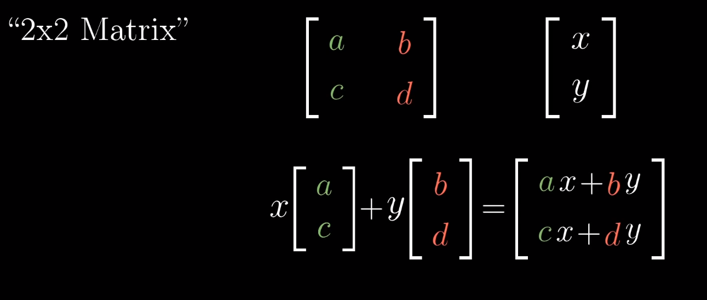
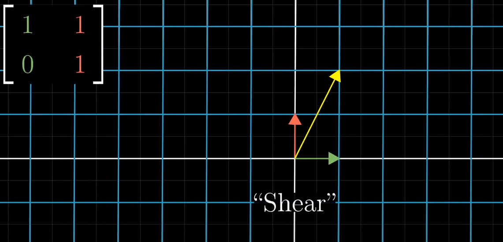
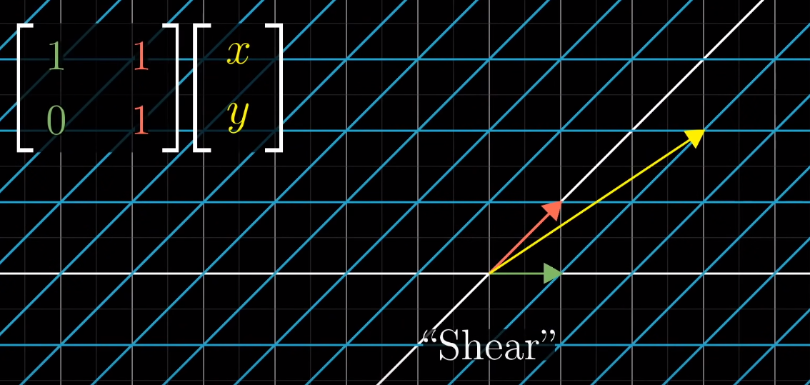

# Matrices as Linear Transformations
### THIS IS THE MOST IMPORTANT TOPIC IN LINEAR ALGEBRA PROBABLY

# Linear Transformation
- ## Tranformation
    - Fancy word for function, takes in inputs, spits out outputs
    - Why use transformation instead of function?
      - To help us understand the movement of a vector when a transformation is applied
      
    - Think about how every possible vector would be transformed from a staring point to an ending point (when conceptualizing vectors as points where the tip is the point and the tail sits at the origin)
    -  Gives the feeling of squishing and morphing space itself
- ## Linear Transformation 
  - A transformation is linear if it maintains 2 properties
    -     1. All lines must remain uncurved lines
    -     2. Origin must remain fixed in place

   - Grid lines remain straight and evenly spaced
   - ### Determining if a transformation is linear
     - If you know a vectors ihat and jhat scalars, you just need to know the starting and landing locations of ihat and jhat
     - You can then package these into a matrix to understand where a vector will land once transformed when you apply a formula (WHAT FORMULA???) using the values from this special matrix
     - 
     - 
- ## Generalized Linear Transformation

  -  ### Pre Transformation
  -  
  -  ### Post Transformation
  -  

# Summary Of Linear Transformations
- Move around space while keeping grid lines parrelel and evenly space
- Origin remains fixed
- These transformations can be described with a small amount of numbers,
  - Specifically the landing posistions of ihat and jhat in a matrix
- Matrices help us describe these nicely
- Matrix = transformation of space :-) 
   
